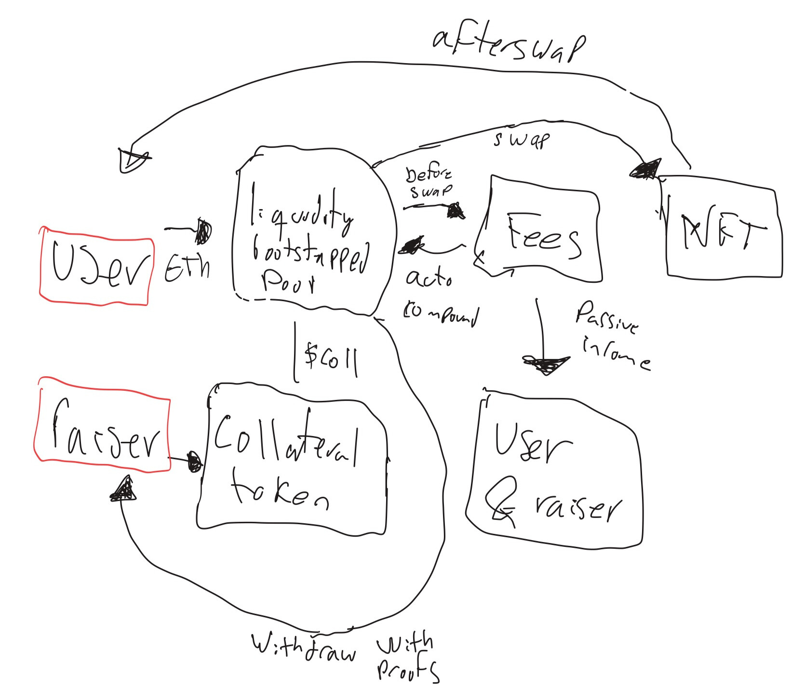

# 🦄 Founil

<div align="center">
  
</div>

**Get funding for your project using Uniswap v4 Hooks 🚀**

## 📺 Project Demo

[](https://youtu.be/CxsyrY74Tc4)

*Click the image above to watch the project demonstration*

## 🎯 What is Founil?

Founil is an innovative funding platform that leverages **Uniswap v4 Hooks** to create a unique donation and reward mechanism. When users make donations by swapping ETH for project tokens, they automatically receive:

- **🪙 Collateral Tokens (COLL)** - Project-specific tokens representing their contribution
- **🖼️ NFT Rewards** - Unique collectibles minted automatically during the swap process
- **💰 Fee Distribution** - Smart fee allocation to project creators

The platform uses custom Uniswap v4 hooks to seamlessly integrate NFT minting and fee distribution directly into the token swap process, creating a gamified funding experience.

## 📊 How It Works

<div align="center">
  
  <p><em>Complete donation flow from ETH swap to NFT minting</em></p>
</div>

## 🏗️ Architecture

The system consists of three main smart contracts:

1. **CollateralToken.sol** - ERC20 token representing project funding
2. **DonationRegistry.sol** - NFT registry managing reward tokens
3. **CustomFeeHook.sol** - Uniswap v4 hook handling automatic NFT minting and fee distribution

## 🚀 Quick Start

### Requirements

This project requires Foundry (stable version). Update to the latest stable version:

```bash
foundryup
```

### Installation

```bash
# Clone the repository
git clone <your-repo-url>
cd founil

# Install dependencies
forge install

# Run tests
forge test
```

## 📋 Deployed Contracts (Sepolia Testnet)

The following contracts are deployed and ready for testing on Sepolia:

```solidity
COLLATERAL_TOKEN = YOUR_COLLATERAL_TOKEN
DONATION_REGISTRY = YOUR_DONATION_REGISTRY 
CUSTOM_FEE_HOOK = YOUR_CUSTOM_FEE_HOOK
POOL_MANAGER = "0xE03A1074c86CFeDd5C142C4F04F1a1536e203543" //Sepolia PM
```

### 🔗 Etherscan Links

Monitor the contracts on Sepolia:
- **[CollateralToken](https://sepolia.etherscan.io/address/0x23038b5f0111025EeDB586fC910b1d4B7Fe6ab51)**
- **[DonationRegistry](https://sepolia.etherscan.io/address/0x72EF52c5d99F4e8a0aeF3d89e6ea87cA7c8e1A3F)**
- **[CustomFeeHook](https://sepolia.etherscan.io/address/0x81b5fbEAe765D68Df634BDE2999AA3c36D75c5A9)**

## 🧪 Testing Guide

### Method 1: Forge Script Testing

Test the complete donation flow using Forge scripts on Sepolia:

```bash
# Test the main user flow
forge script script/SepoliaUserTest.s.sol:SepoliaUserTest \
  --rpc-url $SEPOLIA_RPC_URL \
  --private-key $PRIVATE_KEY \
  --broadcast

# Test hook directly
forge script script/SepoliaUserTest.s.sol:SepoliaUserTest \
  --sig "testHookDirectly()" \
  --rpc-url $SEPOLIA_RPC_URL \
  --private-key $PRIVATE_KEY \
  --broadcast
```

### Method 2: Manual Verification

Verify contracts using Cast commands:

```bash
# Check collateral token supply
cast call $COLLATERAL_TOKEN "totalSupply()" --rpc-url $SEPOLIA_RPC_URL

# Check NFT registry
cast call $DONATION_REGISTRY "totalSupply()" --rpc-url $SEPOLIA_RPC_URL

# Verify hook permissions
cast call $DONATION_REGISTRY "hasRole(bytes32,address)" \
  0x9f2df0fed2c77648de5860a4cc508cd0818c85b8b8a1ab4ceeef8d981c8956a6 \
  $CUSTOM_FEE_HOOK \
  --rpc-url $SEPOLIA_RPC_URL
```

## 🎮 Test Scenarios

### Scenario 1: Basic Donation Flow
1. **Connect wallet** to Sepolia testnet
2. **Check initial balances** (ETH, COLL tokens, NFTs)
3. **Perform donation** (swap 0.01 ETH → COLL tokens)
4. **Verify results**:
   - ETH balance decreased
   - COLL tokens received  
   - NFT minted automatically
   - Transaction recorded on Etherscan

### Scenario 2: Hook Functionality Verification
1. **Direct hook testing** (bypass pool manager)
2. **Verify NFT minting** works independently
3. **Check fee calculation** and distribution logic

### Scenario 3: Contract Integration Test
1. **Verify all contracts** deployed correctly
2. **Check permissions** (hook has minter role on NFT registry)
3. **Validate pool configuration** and liquidity

## ✅ Expected Results

### Successful Test Indicators:
- ✅ User loses ~0.01 ETH (+ gas fees)
- ✅ User receives COLL tokens
- ✅ **NFT is automatically minted** to user's address
- ✅ Transaction appears on [Sepolia Etherscan](https://sepolia.etherscan.io)
- ✅ Fees are distributed to project creator

### Debug Information:
- Pool manager calls hook automatically during swap
- Hook checks `zeroForOne: false` direction
- NFT minted in `afterSwap` hook function
- Fee distribution handled transparently

## 🛠️ Local Development

For local testing, you can deploy and test hooks on [Anvil](https://book.getfoundry.sh/anvil/):

```bash
# Start local Anvil node
anvil --code-size-limit 40000

# Deploy contracts locally
forge script script/DeployAndInit.s.sol --rpc-url http://localhost:8545 --broadcast
```

Scripts in the `script/` directory support both local Anvil and production networks.

## 🔧 Troubleshooting

### Common Issues

**Permission Denied during `forge install`:**
- Ensure GitHub SSH keys are properly configured
- Follow [GitHub SSH setup guide](https://docs.github.com/en/github/authenticating-to-github/connecting-to-github-with-ssh)

**Hook Deployment Failures:**
- Verify hook flags match between `getHookCalls()` and `HookMiner.find(...)`
- Ensure salt mining uses correct deployer address
- For forge script: deployer must be CREATE2 Proxy (`0x4e59b44847b379578588920cA78FbF26c0B4956C`)

**Test Failures:**
- Check deployment logs for errors
- Verify contract addresses are correct
- Ensure sufficient Sepolia ETH for gas
- Confirm pool initialization status

## 🎯 Success Criteria

Your Founil integration is successful when:

1. ✅ **Contracts deployed** and verified on Sepolia
2. ✅ **Users can perform donations** (ETH → COLL swaps)
3. ✅ **NFTs are minted automatically** during swaps
4. ✅ **Hook functions execute** correctly
5. ✅ **Fees are distributed** to project creators
6. ✅ **Transaction history** is visible on Etherscan

## 📚 Additional Resources

- [Uniswap v4 Documentation](https://docs.uniswap.org/contracts/v4/overview)
- [v4-periphery Repository](https://github.com/uniswap/v4-periphery)
- [v4-core Repository](https://github.com/uniswap/v4-core)
- [v4-by-example Tutorials](https://v4-by-example.org)

## 📞 Need Help?

If you encounter issues:
1. Check the **deployment logs** for error details
2. Verify **contract addresses** match your deployment
3. Ensure **Sepolia ETH** balance for gas fees
4. Review **pool initialization** status
5. Open an issue in this repository with detailed error information

---

**Happy Building! 🚀**

*Transform project funding with the power of Uniswap v4 Hooks*